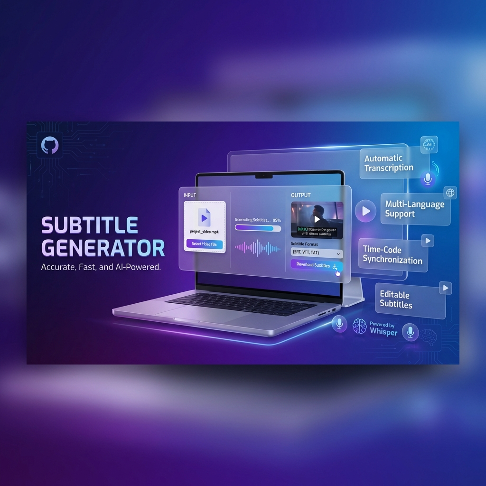

# Subtitle Generator 🎬✨

**Automatically generate accurate subtitles for your videos using AI-powered transcription**

[Download for Windows](#installation) • [Features](#features) • [Documentation](#usage) • [Support](#support)

---

## 📖 Overview

**Subtitle Generator** is a powerful, user-friendly desktop application that automatically generates subtitles for video files using OpenAI's Whisper AI technology. With a simple, intuitive GUI, you can transcribe videos in multiple languages with high accuracy in just a few clicks.

## ✨ Features

- 🤖 **AI-Powered Transcription** - Leverages OpenAI Whisper for state-of-the-art speech recognition
- 🌍 **Multi-Language Support** - Supports transcription in 99+ languages
- 🎯 **High Accuracy** - Industry-leading transcription accuracy
- 🖥️ **Simple GUI** - Clean, intuitive interface - no technical knowledge required
- ⚡ **Fast Processing** - Efficient subtitle generation
- 📁 **Flexible Output** - Generates standard SRT subtitle files
- 🎬 **Universal Format Support** - Works with all common video formats (MP4, AVI, MKV, MOV, etc.)
- 💾 **Local Processing** - All processing happens on your machine - your videos stay private

## 📸 Screenshots

*Clean, simple interface - just select your video and generate subtitles*

## 🚀 Installation

### Windows

1. Download the latest `.exe` installer from the [Releases](../../releases) page
2. Run the installer and follow the setup wizard
3. **Important:** Make sure [FFmpeg](https://ffmpeg.org/download.html) is installed on your system
   - Download FFmpeg and add it to your system PATH
   - Or use a package manager: `winget install ffmpeg` or `choco install ffmpeg`
4. Launch Subtitle Generator from your Start Menu or Desktop

### macOS (Coming Soon)

macOS `.dmg` installer will be available in future releases.

### System Requirements

- **OS:** Windows 10/11 (64-bit) or macOS 10.15+
- **RAM:** 4GB minimum (8GB recommended)
- **Storage:** 2GB free space
- **Dependencies:** FFmpeg (required)

## 📝 Usage

1. **Launch the Application**
   - Open Subtitle Generator from your applications

2. **Select Your Video**
   - Click "Select Video File" or "Browse"
   - Choose the video file you want to transcribe

3. **Generate Subtitles**
   - Click "Generate Subtitles"
   - Wait for the AI to process your video (processing time depends on video length)

4. **Get Your Subtitles**
   - The subtitle file (.srt) will be saved in the same location as your video
   - Use the subtitle file with any video player (VLC, Media Player, etc.)

## 🛠️ Technical Details

### Built With

- **Python** - Core application logic
- **Tkinter** - GUI framework
- **OpenAI Whisper** - AI transcription engine
- **FFmpeg** - Audio/video processing

### How It Works

1. The application extracts audio from your video file using FFmpeg
2. The audio is processed by OpenAI's Whisper AI model
3. Whisper transcribes the speech and generates timestamps
4. The transcription is formatted into standard SRT subtitle format
5. The subtitle file is saved to your chosen location

## 🐛 Troubleshooting

### "FFmpeg not found" Error

**Solution:** Install FFmpeg and ensure it's in your system PATH
- Windows: Download from [ffmpeg.org](https://ffmpeg.org/download.html) and add to PATH
- Or use: `winget install ffmpeg`

### Subtitles are Inaccurate

**Solution:** 
- Ensure audio quality is good (clear speech, minimal background noise)
- Try videos with clearer audio
- Check that the correct language is selected (if language selection is available)

### Application Won't Start

**Solution:**
- Ensure you have the latest version installed
- Check that all dependencies are installed
- Try running as administrator (Windows)

### Slow Processing

**Solution:**
- Processing time depends on video length and your hardware
- Longer videos naturally take more time
- Ensure no other heavy applications are running

## 🤝 Contributing

Contributions are welcome! Please see [CONTRIBUTING.md](CONTRIBUTING.md) for details on how to:
- Report bugs
- Suggest features
- Submit pull requests

## 📄 License

This project is licensed under the MIT License - see the [LICENSE](LICENSE) file for details.

## 🙏 Acknowledgments

- [OpenAI Whisper](https://github.com/openai/whisper) - For the amazing AI transcription technology
- [FFmpeg](https://ffmpeg.org/) - For powerful multimedia processing

## 📧 Support

- **Issues:** [GitHub Issues](../../issues)
- **Discussions:** [GitHub Discussions](../../discussions)

---

**Made with ❤️ for content creators worldwide**

If you find this project helpful, please consider giving it a ⭐!

